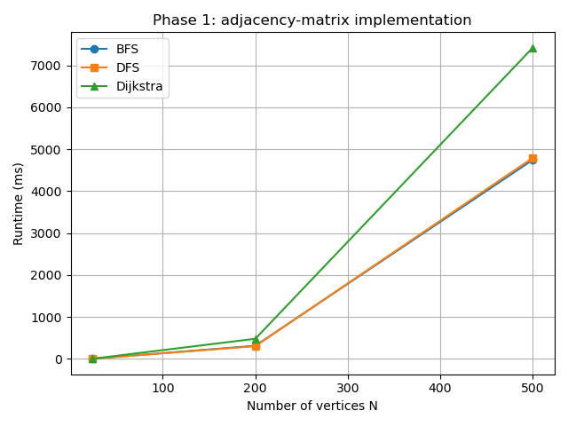
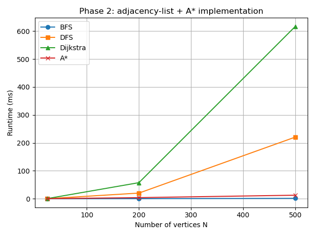
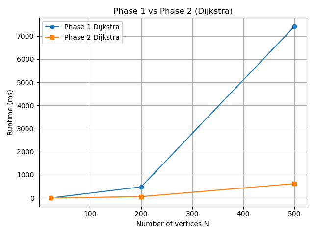

# Airport Route System

A Python-based airport route optimization system that models airline networks as graphs and evaluates multiple path-finding algorithms under different performance constraints.

This project explores how graph representation choices and algorithmic optimizations affect scalability, runtime, and memory usage when routing between airports.

---

## Project Overview

The Airport Route System computes routes between airports using classical graph algorithms and compares their performance across datasets of increasing size.

Two implementations are provided:

- **Baseline implementation** using adjacency matrices  
- **Optimized implementation** using data structures suitable for sparse graphs  

The system supports shortest-path queries, constrained routing, and benchmarking under realistic airline network sizes.

---

## Problem Setting

Airports are modeled as graph nodes and flight routes as weighted edges.  
The system must efficiently compute routes as the network grows from small to large scale.

### Dataset Scale

| Dataset | Airports | Routes | Characteristics |
|--------|----------|--------|----------------|
| Small  | 24       | ~200   | Development & correctness |
| Medium | 200      | ~3,000 | Performance-sensitive |
| Large  | 500      | ~15,000| Stress testing & optimization |

---

## Implementation Phases

### Phase 1: Baseline System

A straightforward implementation to establish correctness and baseline performance.

**Features**
- Adjacency matrix graph representation
- Breadth-First Search (BFS)
- Depth-First Search (DFS)
- Dijkstra’s shortest path algorithm
- Execution time logging for comparison

**Phase illustration**

---

### Phase 2: Optimized System

A refactored version focused on scalability and runtime efficiency.

**Improvements**
- Adjacency list representation for sparse graphs
- Optimized algorithm implementations
- Performance-focused routing utilities

**Phase illustration**

---

### Phase 3: Performance Analysis

A detailed empirical evaluation comparing the two implementations.

**Analysis includes**
- Runtime comparison across dataset sizes
- Scaling behavior as graph size increases
- Memory usage trade-offs
- Speedup calculations between implementations

**Example benchmark / comparison figures**

---

## Project Structure

| File | Description |
|------|-------------|
| `graph_matrix.py` | Phase 1 graph implementation (adjacency matrix) |
| `graph_list.py` | Phase 2 graph implementation (adjacency list) |
| `algorithms_v1.py` | Phase 1 algorithm implementations |
| `algorithms_v2.py` | Phase 2 algorithm implementations |
| `benchmark.py` | Performance testing |
| `main.py` | Entry point / demo runner |
| `step_constraint.py` | Step-constrained routing (max stops) |
| `kth_smallest.py` | K-shortest paths implementation |
| `airport_data_24.md` | Dataset notes (small dataset) |
| `airport_route.pdf` | Project notes / diagrams |

---

## Key Features

- Modular graph representations (matrix vs list)
- Multiple routing strategies
- Benchmarking utilities for empirical performance testing
- Visualization support for routes and comparisons

---

## Implemented Advanced Routing

These are implemented in this repository (not optional):

- **Constrained routing (max stops)**  
  Finds routes under a stop constraint, using a priority-queue approach and tracking steps explicitly.  
  See: `step_constraint.py`

- **K-shortest paths (multiple alternative routes)**  
  Computes ranked alternative routes between the same source/destination (Yen-style approach on top of Dijkstra).  
  See: `kth_smallest.py`

---

## Technical Notes

- Implemented in **Python**
- Uses Python standard libraries (plus `matplotlib` for visualization)
- No external graph libraries (e.g., NetworkX)

---

## Motivation

This project demonstrates how algorithmic choices and data structures directly impact real-world system performance. It highlights trade-offs between simplicity, memory usage, and scalability in graph-based routing systems.
